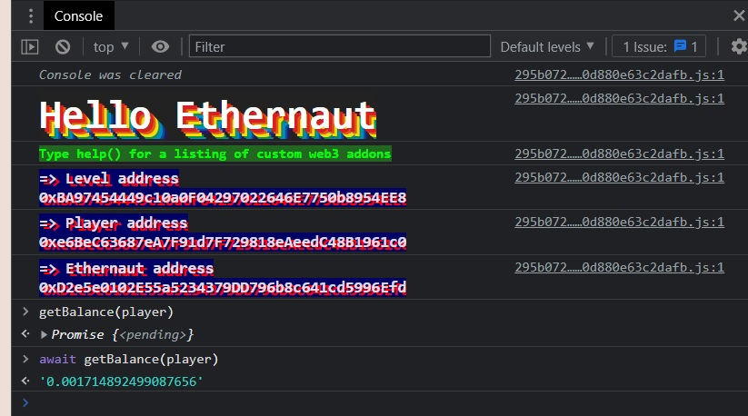
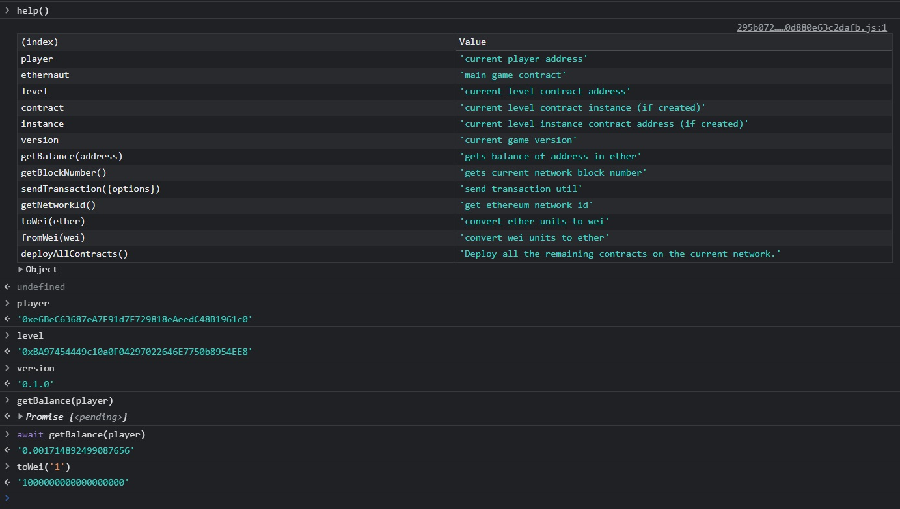
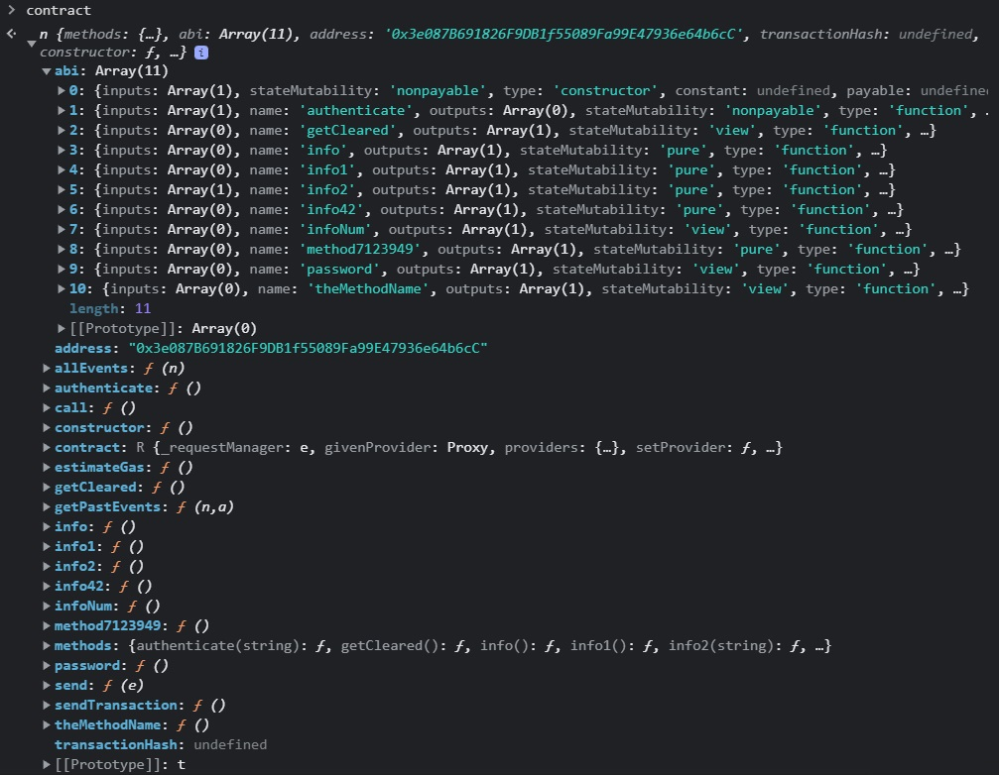
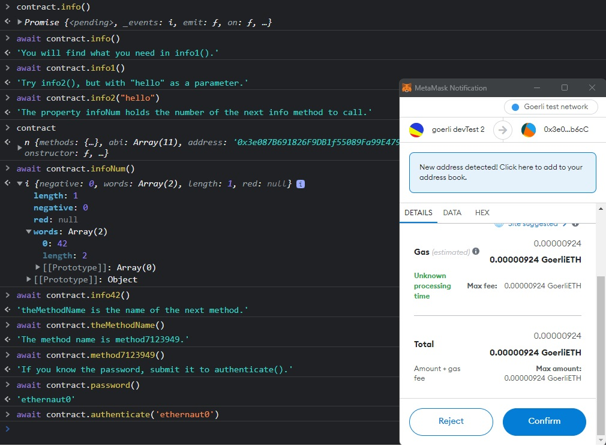
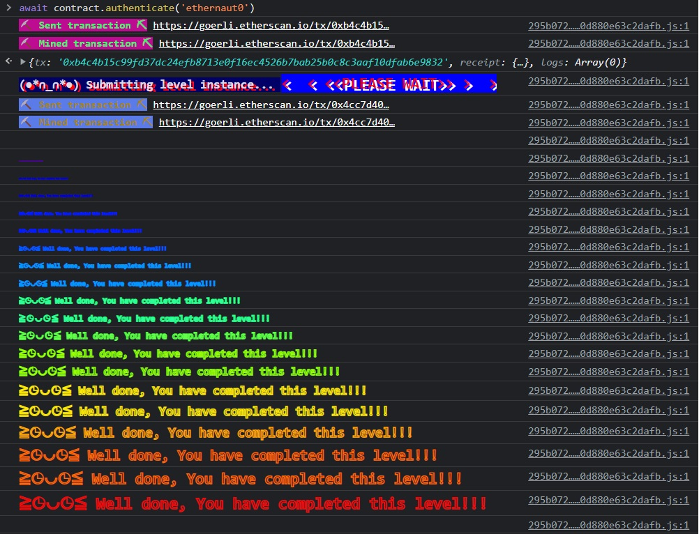

#Hello Ethernaut

This challenge is meant to get us started. We'll need to set up Metamask, open the browser console, learn how to interact with the console tools provided to us, and learn the basics of how we can interact with the smart contracts the game provides us.

##Key learnings:
###'await' async functions
Some functions in  solidity can return data instantaneously, while others need a bit of time to query data. If you're getting a promise as an answer in the console, try using 'await' to retrieve data:

###we have some help!
Notice we can call for help()!

This gives us access to a set of tools that will be useful along the way. Below, you can see me use a few of these.

##Get some goerli ETH

I like to use https://goerlifaucet.com/, it's reasonably fast and painless in late 2022 as I type this.

Once you've gotten enough ETH to pay for the tiny gas fee, create a new instance with the button at the bottom.

Typing 'contract' in the console will show you the currently deployed instance.

##Interact to complete the level

Look into the level's info method contract.info() or await contract.info() if you're using Chrome v62. You should have all you need to complete the level within the contract. When you know you have completed the level, submit the contract using the submit button at the bottom of the page. This sends your instance back to the ethernaut, which will determine if you have completed it.

Below, you can see the series of commands I use to explore this contract's data.

When I finally call the function 'authenticate', it'll prompt metamask to send a transaction. That's because we're writing to the ethereum ledger, not simply reading the state.

If all is right in the world, we're now over the hump! Congrats on your first mission complete, and let the games begin!

