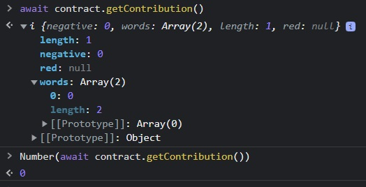
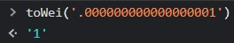
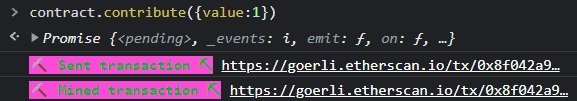
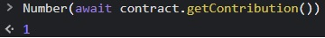
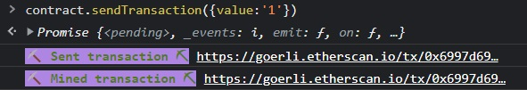
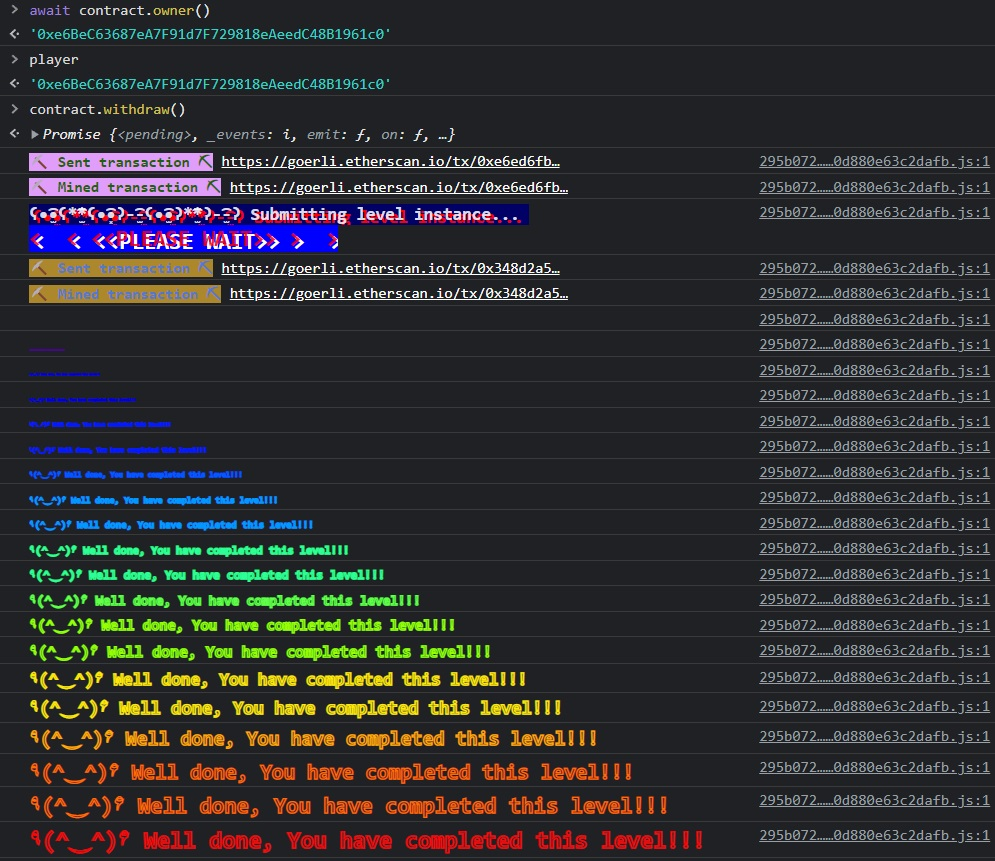

#Fallback

This challenge is meant to teach us the basics of what it means to pwn a contract. Generally, this means to gain control of the funds or roles of a smart contract by modifying the state storage.

Hold on to your hat!

##Contract:

```
// SPDX-License-Identifier: MIT
pragma solidity ^0.8.0;

contract Fallback {

  mapping(address => uint) public contributions;
  address public owner;

  constructor() {
    owner = msg.sender;
    contributions[msg.sender] = 1000 * (1 ether);
  }

  modifier onlyOwner {
        require(
            msg.sender == owner,
            "caller is not the owner"
        );
        _;
    }

  function contribute() public payable {
    require(msg.value < 0.001 ether);
    contributions[msg.sender] += msg.value;
    if(contributions[msg.sender] > contributions[owner]) {
      owner = msg.sender;
    }
  }

  function getContribution() public view returns (uint) {
    return contributions[msg.sender];
  }

  function withdraw() public onlyOwner {
    payable(owner).transfer(address(this).balance);
  }

  receive() external payable {
    require(msg.value > 0 && contributions[msg.sender] > 0);
    owner = msg.sender;
  }
}
```

##Learnings:
Fallback methods are the default way to interact with a contract. 


from https://docs.soliditylang.org/:
_A contract can have at most one fallback function, declared using either fallback () external [payable] or fallback (bytes calldata input) external [payable] returns (bytes memory output) (both without the function keyword). This function must have external visibility. A fallback function can be virtual, can override and can have modifiers._

_The fallback function is executed on a call to the contract if none of the other functions match the given function signature, or if no data was supplied at all and there is no receive Ether function. The fallback function always receives data, but in order to also receive Ether it must be marked payable._

Notice below that if we want to interact with a function, we can specify the contract function by name. 

```
function getContribution() public view returns (uint) {
    return contributions[msg.sender];
  }
```
This solidity function is one we would access with 'await contract.getContribution()', and it'll return a value equal to the amount the sender has deposited:



How could we call the bottom of the three functions below?
```
  function getContribution() public view returns (uint) {
    return contributions[msg.sender];
  }

  function withdraw() public onlyOwner {
    payable(owner).transfer(address(this).balance);
  }

  receive() external payable {
    require(msg.value > 0 && contributions[msg.sender] > 0);
    owner = msg.sender;
  }
```

This is an example of a fallback function. It's good practice to name this function **fallback()**, but the behavior is the same: any interaction with this smart contract that doesn't hit a known function will instead be passed to this fella. 

Now that we know that, how can we abuse it?
Firstly, let's remind ourselves of the goal:

```
You will beat this level if:

1) you claim ownership of the contract
2) you reduce its balance to 0
```

Let's take care of #1. We want the owner role, which we can take possession of by hitting the last line of that fallback function:

```
require(msg.value > 0 && contributions[msg.sender] > 0);
owner = msg.sender;
```

To get past the require statement, we need to send a message with a value greater than 0, and we need to have previously made a contribution that is also greater than 0. Lucky for us, we can send a very tiny amount and get away with both of those! Let's take a look at first making sure we've contributed a bit:

```
function contribute() public payable {
    require(msg.value < 0.001 ether);
    contributions[msg.sender] += msg.value;
    if(contributions[msg.sender] > contributions[owner]) {
      owner = msg.sender;
    }
  }
```

It looks like the only requirement here is to send less than 0.001 ether. Let's see how little we can get away with. Using the utility in our help(), we'll convert from 1 eth to wei, the smallest unit of eth. 



That's the wei!

Let's call the **contribute()** function and give it something slightly more than zero. The right way to do this is to call:
**contract.\<functionName\>({value:\<numberOfWei>})**

We'll call that function, send 1 wei, and confirm in Metamask:



After the transaction is mined, we can validate our efforts have made a valid contribution by calling the getContribution method:



Great! Now let's see if we can call the fallback function and claim the owner role. It looks like all we'll need to do is hit an undefined function:



Now if that worked, we should be the owner...
We'll call the **withdraw()** function, stealing all users' funds, and riding off into the sunset! Hahahaha!



