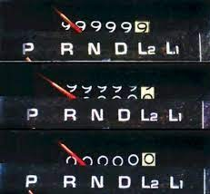
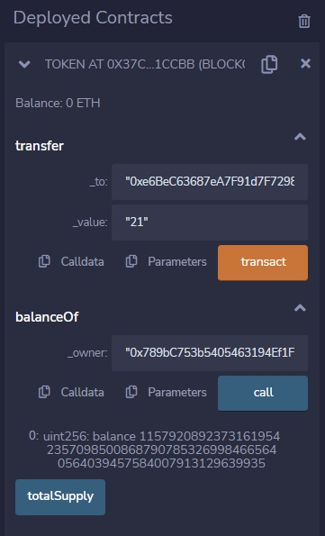
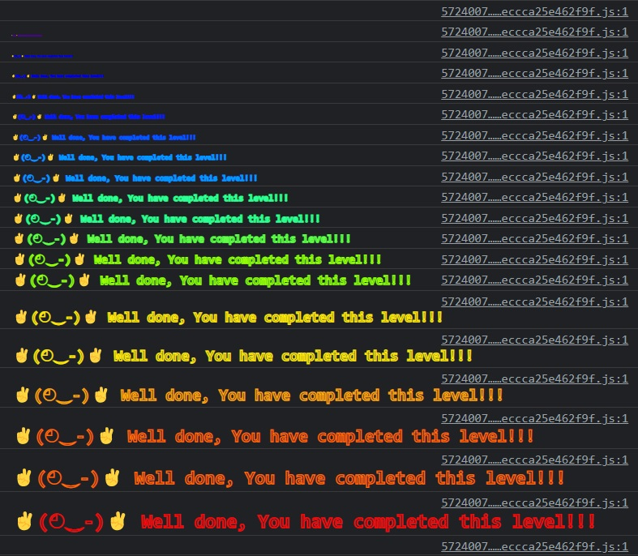

***Token***

The goal of this level is for you to hack the basic token contract below.

You are given 20 tokens to start with and you will beat the level if you somehow manage to get your hands on any additional tokens. Preferably a very large amount of tokens.



*What is an odometer?*

```
// SPDX-License-Identifier: MIT
pragma solidity ^0.6.0;

contract Token {

  mapping(address => uint) balances;
  uint public totalSupply;

  constructor(uint _initialSupply) public {
    balances[msg.sender] = totalSupply = _initialSupply;
  }

  function transfer(address _to, uint _value) public returns (bool) {
    require(balances[msg.sender] - _value >= 0);
    balances[msg.sender] -= _value;
    balances[_to] += _value;
    return true;
  }

  function balanceOf(address _owner) public view returns (uint balance) {
    return balances[_owner];
  }
}
```

The challenge here is clearly exploiting an underflow/overflow error. If it wasn't obvious by the odometer reference, notice we're also using solidity version 0.6. Back then, you'd need to use a safeMath library to prevent exactly this type of problem.

The ***transfer()*** function is the only one that seems to do anything, so let's take a look at the logic:

```
require(balances[msg.sender] - _value >= 0);
    balances[msg.sender] -= _value;
    balances[_to] += _value;
```

The first line has a validation that makes sure that our balance does not go negative when we transfer the tokens. There's no getting around that, we'll need a balance over 0.

The second line edits the value of the sender. It should subtract some number of tokens.

The third line adds the token value to the balance of the receiver (_to).

The *second line* is our target. If we simply pass a value that causes our _value to go lower than 0, we'll underflow:

in binary:
```
00000001 - 1 = smallest possible value, 00000000
00000001 - 2 = largest possible value, 11111111
```

If we simply transfer more than we've got, our balance will be deducted beyond zero, rolling us over to the maximum value.



