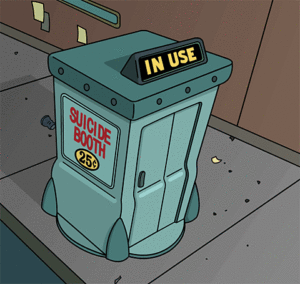
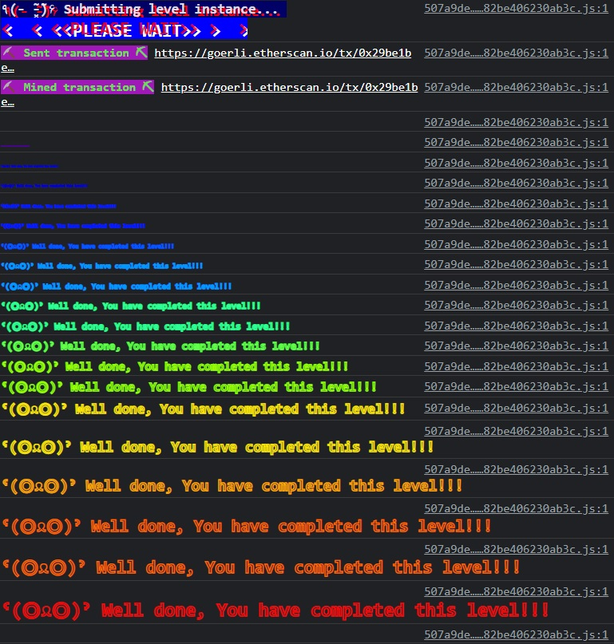

***Force***

In this challenge, we'll need to force some ETH into a contract that's done its best to prevent us from doing exactly that. Here's the contract:

```
// SPDX-License-Identifier: MIT
pragma solidity ^0.8.0;

contract Force {/*

                   MEOW ?
         /\_/\   /
    ____/ o o \
  /~____  =ø= /
 (______)__m_m)

*/}
```

Welp, notice the contract isn't designated as `payable`. This means we can't just send eth to it directly from either an address or smart contract.

The three ways we can send ETH to an address:
1. payable (not valid)
2. mining rewards
3. ~~suicide~~ self-destruct. (EIP-6)



Contract self-destruction is used for two reasons:

-To deprecate buggy contracts: When there is a bug or undesired aspect of a smart contract, the creators can then destroy the contract and forward remaining Ethers to a backup address.

-To clean up used contracts that become obsolete. This is seen as a best practice to free up storage on Ethereum blockchain.

We can `selfdestruct()` to force some funds to any address we'd like.

```
address payable addr = payable(address(etherGame));
selfdestruct(addr);
```

So this one isn't too bad! All we have to do is create a new contract with a self-destruct function that points to our instance, send it any amount of ether, and then blow it up by calling the function!

If you've done it right, the contract should send its entire balance to the specified address. Submit the instance to win!

