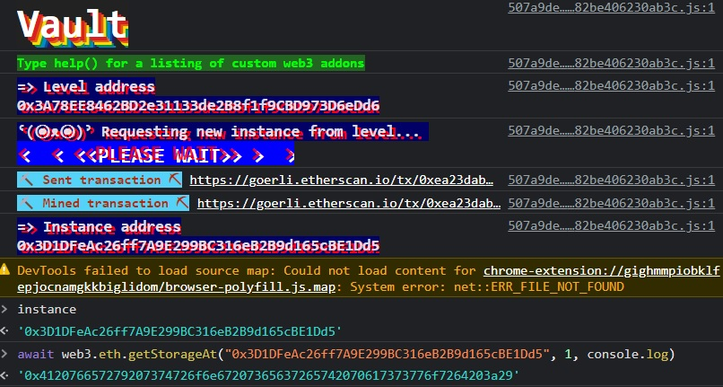
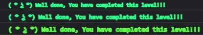

***Vault***

What if you needed to crack a safe? Maybe you've seen the trope in a movie or two; a thief prepares for a heist by researching a target safe, learns how the internal mechanisims work, and listens carefully to manipulate the unseen internals into a configuration that allows the safe to open.

In this challenge, we'll do something similar...


```
pragma solidity ^0.8.0;

contract Vault {
  bool public locked;
  bytes32 private password;

  constructor(bytes32 _password) {
    locked = true;
    password = _password;
  }

  function unlock(bytes32 _password) public {
    if (password == _password) {
      locked = false;
    }
  }
}
```

All we need to do is call the `unlock` function with the correct password. Maybe we can cheat?

We know that when this contract was deployed, the `_password` had to be placed in the constructor, so that info should be stored on the blockchain. We can use `web3.eth.getStorageAt()` to retrieve the data stored at a particular storage slot.

https://solidity-by-example.org/hacks/accessing-private-data/

To use this function, we need the instance and the slot.

Because the state storage first declares variable `locked`, that's slot 0. Then we have the `password`, that's slot 1. Let's plug it in.



Plug that in for the win!



Now you, too, can see into the vault!