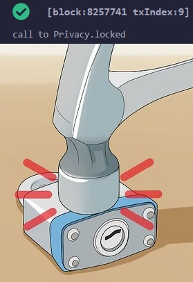
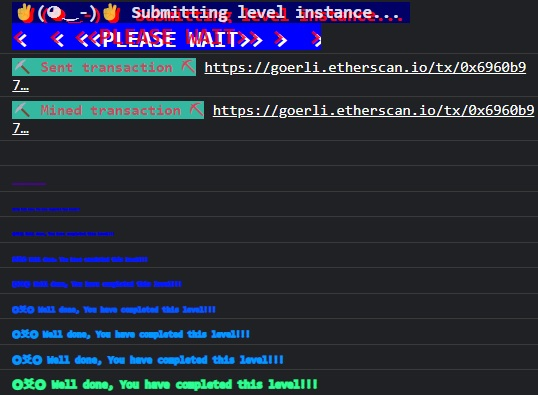

***Privacy***

The creator of this contract was careful enough to protect the sensitive areas of its storage.

Unlock this contract to beat the level.

Things that might help:

Understanding how storage works
Understanding how parameter parsing works
Understanding how casting works

```
// SPDX-License-Identifier: MIT
pragma solidity ^0.8.0;

contract Privacy {

  bool public locked = true;
  uint256 public ID = block.timestamp;
  uint8 private flattening = 10;
  uint8 private denomination = 255;
  uint16 private awkwardness = uint16(block.timestamp);
  bytes32[3] private data;

  constructor(bytes32[3] memory _data) {
    data = _data;
  }
  
  function unlock(bytes16 _key) public {
    require(_key == bytes16(data[2]));
    locked = false;
  }

  /*
    A bunch of super advanced solidity algorithms...

      ,*'^`*.,*'^`*.,*'^`*.,*'^`*.,*'^`*.,*'^`
      .,*'^`*.,*'^`*.,*'^`*.,*'^`*.,*'^`*.,*'^`*.,
      *.,*'^`*.,*'^`*.,*'^`*.,*'^`*.,*'^`*.,*'^`*.,*'^         ,---/V\
      `*.,*'^`*.,*'^`*.,*'^`*.,*'^`*.,*'^`*.,*'^`*.,*'^`*.    ~|__(o.o)
      ^`*.,*'^`*.,*'^`*.,*'^`*.,*'^`*.,*'^`*.,*'^`*.,*'^`*.,*'  UU  UU
  */
}
```

When this smart contract is deployed, the owner passes an array of data to it:
```
constructor(bytes32[3] memory _data) {
    data = _data;
  }
```

This same array is what we'll need to investigate to find the key, which appears to be hidden in the 3rd position of the array:
```
require(_key == bytes16(data[2]));
```

`await web3.eth.getStorageAt("0x23f6c788082B56994Ba2B99c801970157798Defd",0)`
0x0000000000000000000000000000000000000000000000000000000000000001
This is a bool showing a value of one but filling up an entire 32-byte storage slot, from the line `bool public locked = true;`

`await web3.eth.getStorageAt("0x23f6c788082B56994Ba2B99c801970157798Defd",1)`
0x0000000000000000000000000000000000000000000000000000000063b5d448
await web3.utils.hexToNumber("0x0000000000000000000000000000000000000000000000000000000063b5d448")
1672860744
This is an epoch timestamp representing January 4th, 2023 from `uint256 public ID = block.timestamp;`
notice how much wasted space there is for the data here!

`await web3.eth.getStorageAt("0x23f6c788082B56994Ba2B99c801970157798Defd",2)`
0x00000000000000000000000000000000000000000000000000000000d448ff0a
web3.utils.hexToBytes("0x00000000000000000000000000000000000000000000000000000000d448ff0a")
(32) [0, 0, 0, 0, 0, 0, 0, 0, 0, 0, 0, 0, 0, 0, 0, 0, 0, 0, 0, 0, 0, 0, 0, 0, 0, 0, 0, 0, 212, 72, 255, 10]
This is a packed Bytes32 string carrying the value of the following vars: `flattening=10`, `denomination=255`, and `awkwardness=uint16(block.timestamp)`
Notice this is packing three separate variables into one storage slot. Neat!

Next we've got a fixed array with 3 elements of type bytes32:

await web3.eth.getStorageAt("0x23f6c788082B56994Ba2B99c801970157798Defd",3)
'0x30c9db0084ff4b324e4d7a9720dee8f76f443bd35f7d1a20e58ecf1f095c45fa'

await web3.eth.getStorageAt("0x23f6c788082B56994Ba2B99c801970157798Defd",4)
'0x283d6b120b52ebca8682a01db7c4cc759a2b8008fade42d71d1dea8ad31275fd'

await web3.eth.getStorageAt("0x23f6c788082B56994Ba2B99c801970157798Defd",5)
'0x8e2fc71ce78833125df7860d4236cf440807e0d743ddbf6e4fbed8cc29de4999'

Since we know the key is at index 2 of the array, let's take the third element here and cast it to a bytes16 by taking only the first half of the values after 0x:
0x8e2fc71ce78833125df7860d4236cf44



